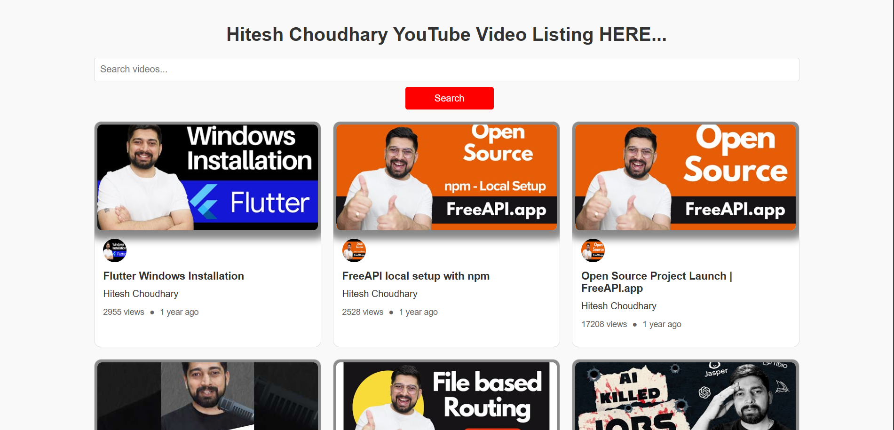
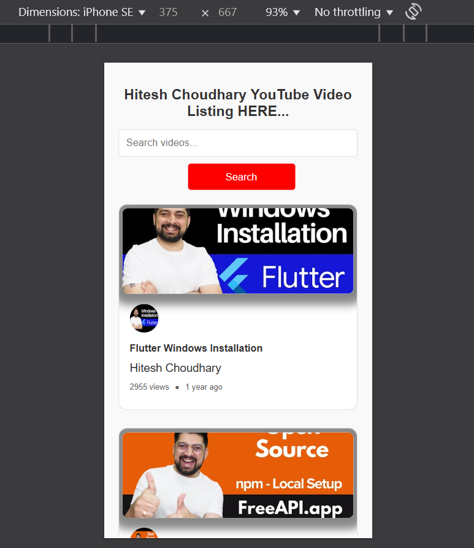

YouTube Video Listing Project:-

This project is a YouTube-style video listing page that fetches and displays videos from the FreeAPI YouTube endpoint. It allows users to browse videos, search for specific content, and load more videos dynamically.

Features:-
Fetch and Display Videos:

Fetches video data from the FreeAPI YouTube endpoint.

Displays video thumbnails, titles, channel names, view counts, and publication dates.

Search Functionality:-

Allows users to search for videos by title or channel name.

Filters videos on the frontend without additional API calls.

Load More Videos:-

Implements a "Load More" button to fetch and display additional videos dynamically.

Responsive Design:-

The layout is responsive and works well on different screen sizes.

Time Ago Feature:-

Displays how long ago a video was published in a user-friendly format (e.g., "2 days ago").

Technologies Used
HTML: Structure of the page.

CSS: Styling and responsive design.

JavaScript: Fetching data, generating cards, and handling user interactions.

FreeAPI YouTube Endpoint: Provides video data.

How to Use
Clone the Repository:

git clone:- https://github.com/ArzoRaza/cohort/tree/main/06_assignment/02_youtuve_video_listing
Open the Project:

Open the index.html file in your browser.

Interact with the Page:

Browse the list of videos.

Use the search bar to filter videos by title or channel name.

Click the "Load More" button to fetch additional videos.

LIVE DEMO:- https://hitesh-choudhary-yvl.vercel.app/

GitHub Repository:- https://github.com/ArzoRaza/cohort/tree/main/06_assignment/02_youtuve_video_listing

Screenshots of project: 

