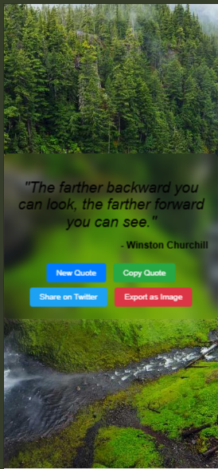

Features
Fetch Random Quote:

Fetches a random quote from the FreeAPI endpoint and displays it on the page.

New Quote Button:

Allows users to fetch and display a new random quote.

Copy to Clipboard:

Copies the quote and author to the clipboard.

Share on Twitter:

Opens a Twitter intent window to share the quote.

Random Background Image:

Sets a random background image from Unsplash every time a new quote is fetched.

Export as Image:

Exports the quote and author as an image using the html2canvas library.

How to Use
Clone the Repository:

Copy
git clone https://github.com/ArzoRaza/cohort/tree/main/06_assignment/03_quote_of_the_day
Open the Project:

Open the index.html file in your browser.

Interact with the Page:

Click the "New Quote" button to fetch a new random quote.

Use the "Copy Quote" button to copy the quote to the clipboard.

Share the quote on Twitter using the "Share on Twitter" button.

Export the quote as an image using the "Export as Image" button.

Dependencies
html2canvas: Used to export the quote as an image. Include it in your project by adding the following script tag to your HTML:

html
Copy

Run HTML
Deployment
Deploy the project live for free using platforms like:

Vercel: https://random-quote-a3.vercel.app/

screenshots

